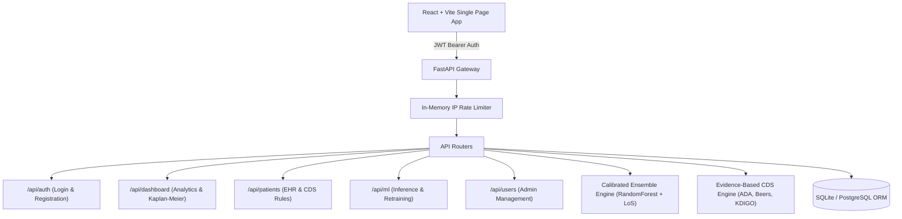

# HealthForecast AI — Patient Readmission Risk Prediction & Healthcare Analytics Platform

[](https://fastapi.tiangolo.com)
[](https://react.dev)
[](https://vitejs.dev)
[](https://scikit-learn.org)
[](https://github.com/mailech/HealthForecast-AI)

**HealthForecast AI** is an enterprise-grade clinical decision support and healthcare analytics platform. Powered by calibrated Machine Learning ensemble models trained on over 100,000 diabetic inpatient encounters (Diabetes 130-US Hospitals dataset), the platform forecasts 30-day patient readmission risks, predicts hospital Length of Stay (LoS), generates evidence-based clinical recommendations, and delivers role-tailored operational dashboards.

---

## 🌟 Key Architecture & Multi-Role Modules

The platform enforces strict **Role-Based Access Control (RBAC)** across 4 specialized user roles:



### 1. 🩺 Doctor Module
* **Clinical Overview Dashboard (`/dashboard/doctor`)**: Immediate census metrics (Assigned Patients, High-Risk Watchlist, Readmission Rates, Average LoS), live patient risk roster, and 30-day readmission breakdowns.
* **Assigned Patient Registry (`/patients`)**: Searchable, filterable patient directory restricted to assigned cohorts.
* **Clinical Decision Support & Patient Detail (`/patients/:id`)**: Comprehensive medical history, diagnostic clusters (ICD-9), prescribed medication regimens, and automated clinical recommendations.
* **Risk Intelligence Engine (`/analytics/risk`)**: Feature importance drivers, demographic risk breakdowns, and multi-variable clinical stratification.

### 2. 🏥 Hospital Administrator Module
* **Executive Dashboard (`/dashboard/admin`)**: Institutional KPIs, admission volume trends, readmission benchmarks, and capacity analytics.
* **Patient Directory (`/patients`)**: Institution-wide patient records view.
* **Department Performance (`/analytics/performance`)**: Department throughput, specialty patient share, and Risk-Adjusted Quality Scorecards (Observed vs. Expected O/E ratios).
* **Comparative Regimen Analytics**: Evaluates 30-day readmission rates, glycemic stabilization, and relative risk reduction across therapeutic regimens.

### 3. 🔬 Healthcare Researcher Module
* **Research Analytics (`/dashboard/researcher`)**: Aggregate population metrics and HIPAA Safe Harbor-compliant anonymized dataset exports.
* **De-Identified Patient Cohorts (`/patients`)**: Fully masked patient directory with deterministic pseudonymized subject identifiers (raw EHR numbers and PII stripped).
* **Population Trends (`/analytics/trends`)**: Epidemiological age group distributions, racial/ethnic representation, and longitudinal comorbidity hazard analysis.

### 4. 🛡️ System Administrator Module
* **DevSecOps Dashboard (`/dashboard/sysadmin`)**: Real-time microservice status, API latency logs, database health monitoring, and system uptime tracking.
* **User & RBAC Governance (`/users`)**: User provisioning, dynamic role assignment, and account activation/deactivation.
* **ML Lifecycle & Retraining (`/dashboard/sysadmin`)**: Automated background model re-training triggers on historical datasets with audit history logs.

---

## 🧠 AI Machine Learning & CDS Engine

### 1. Readmission & Length of Stay Models
* **Algorithm**: Calibrated Ensemble Classifier (`RandomForestClassifier` with isotonic/sigmoid probability calibration) and `RandomForestRegressor` for Length of Stay prediction.
* **Dataset**: Diabetes 130-US Hospitals (101,766 clinical encounters, 10 years of clinical care).
* **Clinical Feature Engineering**:
  * Glycemic severity indexing (HbA1c levels $>7\%$, $>8\%$, glucose serum excursions $>200$, $>300$).
  * Prior utilization index (Emergency visits, Outpatient encounters, Inpatient hospitalizations).
  * Medication complexity and dosage adjustments (`Up`, `Down`, `Steady`, `No`).
  * ICD-9 clinical cluster mappings (Diabetes, Circulatory, Respiratory, Digestive, Genitourinary, Neoplasms, Musculoskeletal).
* **Artifact Integrity**: Automated SHA-256 cryptographic verification prior to model deserialization.

### 2. Evidence-Based Clinical Decision Support (CDS) Rules
* **ADA Standards of Care (2024)**: Post-discharge glycemic monitoring, SGLT2i / GLP-1RA therapy evaluation, and insulin titration protocols.
* **Beers Criteria (Geriatric Safety)**: High-risk hypoglycemia screening in patients aged $\ge 65$ on long-acting sulfonylureas.
* **CMS Hospital Readmission Reduction Program (HRRP)**: Rapid 7-day post-discharge transitional care planning for patients with heart failure or prior hospitalizations.
* **KDIGO Guidelines**: Metformin renal safety adjustments based on renal staging.

---

## 🔒 Security, Privacy & Compliance Hardening

The application has been audited and hardened across all architectural layers:

* **Authentication & Session Security**:
  * JWT access tokens with configurable expiration (default 120 minutes).
  * Passwords hashed using Bcrypt with cryptographically generated salts.
  * In-memory sliding-window IP rate limiting (`15 req/min` on auth endpoints, `5 req/5min` on model retraining).
* **Access Control & Anti-Escalation**:
  * Public registration restricted strictly to `doctor` and `researcher` roles. Administrative roles can only be granted by existing System Administrators.
  * All dashboard and analytics endpoints enforced with authentication dependencies.
* **HIPAA & Data Privacy**:
  * Researcher role views enforce Safe Harbor de-identification: direct medical record numbers are masked via deterministic one-way pseudonymization.
  * Prescriptive Clinical Decision Support (CDS) endpoints are strictly restricted from research accounts (403 Forbidden).
* **Network & ML Integrity**:
  * Strict CORS whitelist enforcement (`CORS_ORIGINS`) prevents unauthorized cross-origin requests.
  * Input schema validation with strict numerical bounds (`time_in_hospital`, `num_medications`, `num_lab_procedures`) prevents unhandled exceptions.
  * SHA-256 hash checks prevent insecure deserialization vulnerabilities.

---

## 🛠️ Technology Stack

| Layer | Technologies |
| :--- | :--- |
| **Frontend** | React 19, Vite 8, React Router v7, Recharts 3, Lucide React, Vanilla CSS |
| **Backend API** | Python FastAPI 0.115+, Uvicorn, Pydantic v2, Pydantic-Settings |
| **Database & ORM** | SQLite / PostgreSQL, SQLAlchemy 2.0+ |
| **Machine Learning** | Scikit-Learn, Joblib, NumPy, Pandas, XGBoost |
| **Authentication & Crypto** | Python-Jose (JWT), Passlib, Bcrypt, Hashlib |

---

## 🚀 Local Installation & Setup

### Prerequisites
* **Python 3.10+** installed
* **Node.js 18+** & **npm** installed

---

### 1. Backend Setup

### 🐳 Quick Start with Docker (Recommended)

Run the full stack (FastAPI backend + React frontend + Nginx + persistent storage) in one command:

```bash
# Start all containers in the background
docker compose up --build -d
```

* **Frontend UI**: [http://localhost:3000](http://localhost:3000)
* **Backend API & Swagger Docs**: [http://localhost:8000/docs](http://localhost:8000/docs)
* **Health Check**: [http://localhost:8000/api/health](http://localhost:8000/api/health)

> For full details, development mode with hot-reloading, volume management, and troubleshooting, see [DOCKER.md](file:///d:/Infosys%20Internship%20project/HealthForecast%20AI/DOCKER.md).

---

### 🛠️ Manual Local Setup

#### 1. Backend Setup

```bash
# Navigate to the backend directory
cd backend

# Create and activate a Python virtual environment
python -m venv venv
# On Windows:
.\venv\Scripts\activate
# On Linux/macOS:
source venv/bin/activate

# Install dependencies
pip install -r requirements.txt

# Configure environment variables (copy from template)
cp .env.example .env
```

#### Backend Environment Variables (`backend/.env`)
```ini
PROJECT_NAME="HealthForecast AI"
VERSION="1.0.0"
API_V1_STR="/api"
SECRET_KEY="your_secure_jwt_secret_key_here"
ALGORITHM="HS256"
ACCESS_TOKEN_EXPIRE_MINUTES=120
DATABASE_URL="sqlite:///./healthforecast.db"
CORS_ORIGINS=["http://localhost:5173","http://127.0.0.1:5173","http://localhost:3000"]
SEED_DEMO_DATA=True
```

#### Start the Backend Server
```bash
python -m uvicorn app.main:app --port 8000 --reload
```
* **API Base URL**: `http://localhost:8000/api`
* **Interactive Swagger Docs**: `http://localhost:8000/docs`
* **ReDoc OpenAPI Documentation**: `http://localhost:8000/redoc`

---

### 2. Frontend Setup

```bash
# Navigate to the frontend directory
cd frontend

# Install npm dependencies
npm install

# Start the Vite development server
npm run dev
```
* **Frontend Web Application**: `http://localhost:5173`

---

## 👥 Demo User Accounts for Testing

When `SEED_DEMO_DATA=True`, the platform automatically provisions test accounts for each role:

| Role | Email | Password | Primary Module |
| :--- | :--- | :--- | :--- |
| **Doctor** | `doctor1@healthforecast.ai` | `Password123!` | `/dashboard/doctor` |
| **Doctor** | `doctor2@healthforecast.ai` | `Password123!` | `/dashboard/doctor` |
| **Hospital Admin** | `admin1@healthforecast.ai` | `Password123!` | `/dashboard/admin` |
| **Hospital Admin** | `admin2@healthforecast.ai` | `Password123!` | `/dashboard/admin` |
| **Researcher** | `researcher1@healthforecast.ai` | `Password123!` | `/dashboard/researcher` |
| **Researcher** | `researcher2@healthforecast.ai` | `Password123!` | `/dashboard/researcher` |
| **System Admin** | `sysadmin1@healthforecast.ai` | `Password123!` | `/dashboard/sysadmin` |
| **System Admin** | `sysadmin2@healthforecast.ai` | `Password123!` | `/dashboard/sysadmin` |

---

## 📡 REST API Route Catalog

### Authentication (`/api/auth`)
* `POST /api/auth/login`: OAuth2 password flow login (returns JWT token and user profile).
* `GET /api/auth/me`: Fetch authenticated user profile.
*(Note: Public self-registration is disabled. Accounts are provisioned by System Administrators via `/api/users`)*

### Patient & Clinical Records (`/api/patients`)
* `GET /api/patients`: Searchable, paginated patient roster (de-identified for researchers, assigned-only for doctors).
* `GET /api/patients/{id}`: Detailed encounter records, labs, diagnoses, and medications.
* `GET /api/patients/{id}/cds`: Evidence-based Clinical Decision Support recommendations (medical personnel only).
* `POST /api/patients/with-admission`: Register new patient encounter and compute real-time AI risk prediction.

### Healthcare Analytics (`/api/dashboard`)
* `GET /api/dashboard/stats`: High-level census, risk cohort counts, and readmission benchmarks.
* `GET /api/dashboard/readmission-overview`: Readmission category distributions.
* `GET /api/dashboard/demographics`: Patient demographics by age, gender, or race.
* `GET /api/dashboard/hospital-performance`: Department throughput and Risk-Adjusted Quality Scorecard.
* `GET /api/dashboard/treatment-effectiveness`: Comparative efficacy across therapeutic regimens.
* `GET /api/dashboard/advanced-analytics`: Kaplan-Meier 30-day survival curves and comorbidity hazard ratios.

### Machine Learning Engine (`/api/ml`)
* `GET /api/ml/metrics`: Active ensemble model evaluation metrics and feature importances.
* `GET /api/ml/version`: Model version tag, dataset size, and operational status.
* `GET /api/ml/history`: Model training audit trail.
* `POST /api/ml/predict`: Live calibrated readmission risk prediction with bounds validation.
* `POST /api/ml/predict-los`: Secondary Length of Stay (LoS) prediction.
* `POST /api/ml/retrain`: Trigger background model re-training (System Administrator only).

### User Administration (`/api/users`)
* `GET /api/users`: List all platform users (System Admin only).
* `POST /api/users`: Provision new administrative or clinical accounts.
* `PUT /api/users/{id}`: Update user metadata, roles, or active status.
* `DELETE /api/users/{id}`: Deactivate user account.

---

## 📌 Repository Information

* **Repository**: [https://github.com/mailech/HealthForecast-AI.git](https://github.com/mailech/HealthForecast-AI.git)
* **Active Branch**: `nandanGogari`