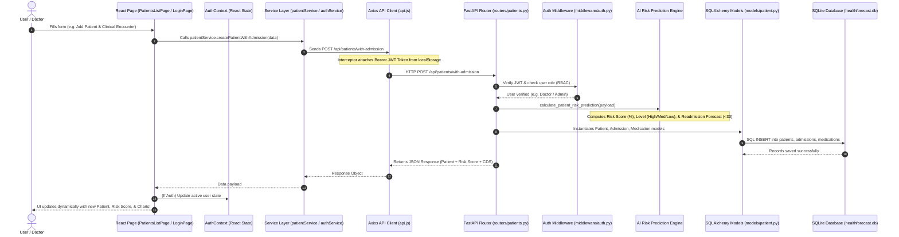

# HealthForecast AI — Dataflow & File Architecture Guide

This guide explains **how every file in the project works** and **how data flows end-to-end** from the User Interface (React) down to the Database (SQLite/FastAPI) and back.

---

## 1. High-Level System Dataflow Diagram



---

## 2. Comprehensive File-by-File Breakdown

### 📁 Frontend Architecture (`frontend/src/`)

```
src/
├── main.jsx                 # Entry point: Mounts React application into HTML DOM
├── App.jsx                  # Main Router: Defines application routes & Protected Guards
├── index.css                # Global Design System: Color tokens, CSS styles, typography
├── context/
│   └── AuthContext.jsx      # Global Auth State: Holds current user, JWT token, login/logout logic
├── services/
│   ├── api.js               # Central Axios HTTP client with request/response interceptors
│   ├── authService.js       # Calls backend /api/auth endpoints (login, register, me)
│   ├── patientService.js    # Calls backend /api/patients endpoints (list, get, create)
│   ├── dashboardService.js  # Calls backend /api/dashboard endpoints (stats, charts)
│   └── userService.js       # Calls backend /api/users endpoints (SysAdmin user management)
├── components/
│   ├── layout/
│   │   ├── Sidebar.jsx      # Left navigation sidebar (role-aware menu items)
│   │   ├── Navbar.jsx       # Top navigation header (user profile, search, notifications)
│   │   └── DashboardLayout.jsx # Page wrapper layout containing Sidebar + Navbar + Content
│   └── common/
│       ├── Badge.jsx        # Status & risk badges (High Risk = Red, Medium = Amber, Low = Green)
│       ├── StatsCard.jsx    # Metric KPI cards (Value, Icon, Subtitle, Trend indicator)
│       └── ProtectedRoute.jsx # Route guard checking authentication & role permissions
└── pages/
    ├── auth/                # Module 1: Authentication Pages
    │   ├── LoginPage.jsx    # Sign-in form with Quick Role Demo buttons
    │   ├── RegisterPage.jsx # Account registration form
    │   └── UnauthorizedPage.jsx # Access denied screen for restricted roles
    ├── dashboard/           # Module 2: Role-Based Analytics Dashboards
    │   ├── DoctorDashboard.jsx     # Doctor view (Patient watchlist & risk breakdown)
    │   ├── AdminDashboard.jsx      # Hospital Admin view (Specialty performance)
    │   ├── ResearcherDashboard.jsx # Researcher view (Population health & CSV export)
    │   └── SysAdminDashboard.jsx   # System Admin view (User management table)
    └── patients/            # Module 3: Clinical Patient Management
        ├── PatientsListPage.jsx    # Searchable patient directory + Add Patient Modal
        └── PatientDetailPage.jsx   # Clinical profile, AI risk score, & Care suggestions
```

---

### 📁 Backend Architecture (`backend/app/`)

```
backend/app/
├── main.py                  # FastAPI Application Entry: CORS, Routers, Database startup event
├── config.py                # Environment Configuration: Database URL, JWT secret key, Expiry
├── database.py              # SQLAlchemy DB Engine: Connection pooling, SessionLocal, Base
├── middleware/
│   └── auth.py              # Security Guards: get_current_user (JWT decode) & require_roles (RBAC)
├── utils/
│   ├── security.py          # Cryptography: Password hashing (bcrypt) & JWT encoding/decoding
│   └── seed_data.py         # DB Initializer: Seeds 2 demo users per role & Diabetes patient dataset
├── models/                  # SQLAlchemy Relational Models (Database Tables)
│   ├── user.py              # Table: 'users' (id, email, password, role, hospital_name)
│   ├── patient.py           # Table: 'patients' (id, patient_nbr, name, age, race, gender)
│   ├── admission.py         # Table: 'admissions' (id, lab procedures, diagnoses, risk_score, readmitted)
│   └── medication.py        # Table: 'medications' (id, medication_name, dosage_status)
├── schemas/                 # Pydantic Schemas (API Data Validation)
│   ├── user.py              # User request/response validation schemas
│   ├── patient.py           # Patient & Admission validation schemas (PatientWithAdmissionCreate)
│   └── dashboard.py         # Analytics & chart response schemas
└── routers/                 # REST API Endpoint Controllers
    ├── auth.py              # POST /api/auth/login, POST /api/auth/register, GET /api/auth/me
    ├── users.py             # GET /api/users, PUT /api/users/{id}, DELETE /api/users/{id}
    ├── patients.py          # GET /api/patients, GET /api/patients/{id}, POST /api/patients/with-admission
    └── dashboard.py         # GET /api/dashboard/stats, /readmission-overview, /demographics
```

---

## 3. How Data Flows During Key User Actions

### Scenario A: Doctor Logs In (`LoginPage.jsx`)
1. User clicks `🩺 Doctor 1` button on `LoginPage.jsx`.
2. `LoginPage.jsx` calls `authService.login('doctor1@healthforecast.ai', 'Password123!')`.
3. `authService.js` sends an HTTP POST request to `http://localhost:8000/api/auth/login`.
4. Backend `routers/auth.py` receives the email, verifies password using `security.py` (`bcrypt.checkpw`), and generates a JWT token signed with `SECRET_KEY`.
5. Frontend receives `{ access_token, user }`. `AuthContext.jsx` stores the token and user in `localStorage`.
6. User is redirected to `/dashboard/doctor`.

---

### Scenario B: Adding a Patient & Running AI Risk Engine (`PatientsListPage.jsx`)
1. Doctor opens `PatientsListPage.jsx` and clicks `+ Add Patient & Medical History`.
2. Fills in clinical features (Age, Primary Diagnosis ICD-9, HbA1c Test Result, Lab Procedures Count, Prior Inpatient Admissions).
3. Click `Analyze Risk & Save Patient`.
4. `patientService.js` sends POST request to `/api/patients/with-admission`.
5. Backend `routers/patients.py` receives the data:
   - `calculate_patient_risk_prediction()` computes the risk score:
     $$\text{Risk Score} = (\text{Inpatient} \times 18) + (\text{Lab Procedures} \times 0.4) + (\text{Medications} \times 1.5) + \text{HbA1c Bonus}$$
   - Saves `Patient`, `Admission`, and `Medication` records to SQLite database via SQLAlchemy `SessionLocal`.
6. Response returns to frontend → Table auto-refreshes and displays the new patient with **Risk Level (High/Medium/Low)** and **Readmission Forecast (`<30 Days`)**!
