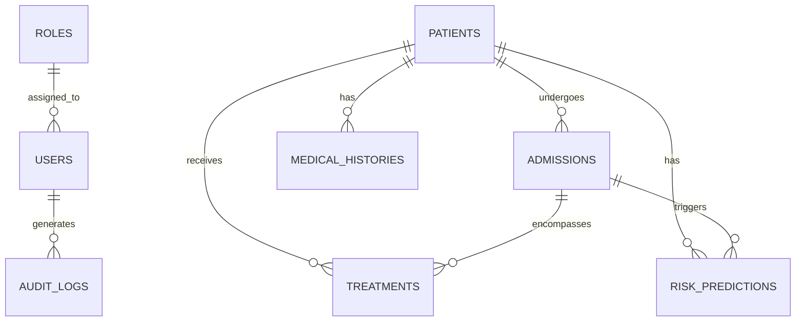

# HealthForecast AI: System Architecture Specification

## 1. Executive Summary

HealthForecast AI is an enterprise healthcare predictive analytics and risk intelligence platform. Built to optimize hospital readmission workflows, evaluate treatment efficacy, and provide actionable clinical decision support, the platform integrates Machine Learning (ML) models with Role-Based Access Control (RBAC) and real-time clinical telemetry.

---

## 2. Technical Stack & Components

```
+-----------------------------------------------------------------------+
|                              PRESENTATION                             |
| React 18 SPA | Tailwind CSS | Recharts | Lucide Icons | Axios | Vite  |
+-----------------------------------------------------------------------+
                                   | HTTP/REST JSON (JWT Bearer)
+-----------------------------------------------------------------------+
|                               API LAYER                               |
| FastAPI Web Framework | CORS Middleware | Pydantic Schemas | OAuth2   |
+-----------------------------------------------------------------------+
                                   |
+-----------------------------------------------------------------------+
|                            BUSINESS & ML                             |
| ClinicalRiskEngine | Scikit-Learn (RandomForest, GB) | Pandas / NumPy |
+-----------------------------------------------------------------------+
                                   | ORM (SQLAlchemy)
+-----------------------------------------------------------------------+
|                            DATA PERSISTENCE                           |
| PostgreSQL 15 / SQLite3 | Alembic Migrations | Indexing Engine       |
+-----------------------------------------------------------------------+
```

### 2.1 Frontend Layer
- **Framework**: React 18 SPA built with Vite
- **Styling**: Vanilla CSS + Tailwind CSS (Custom Dark/Light Clinical Aesthetics)
- **Charts & Visualization**: Recharts (ROC Curves, Feature Importances, Confusion Matrices)
- **State & Auth**: React Context API (`AuthContext`) with persistent JWT local storage

### 2.2 Backend Layer
- **Framework**: FastAPI (Python 3.10+) with Uvicorn ASGI server
- **Validation**: Pydantic V2 schemas
- **Authentication**: JWT Tokens (HS256 encryption with bcrypt password hashing)
- **ML Services**: `ClinicalRiskEngine` executing real-time feature transformation, RandomForest, and GradientBoosting prediction models

### 2.3 Data Layer
- **ORM**: SQLAlchemy ORM with connection pooling
- **RDBMS**: PostgreSQL 15 (Production) / SQLite3 (Development & Unit Testing)
- **Schema**: Fully relational database tracking Patients, Admissions, Medical Histories, Treatments, Audit Logs, and ML Risk Predictions.

---

## 3. Data Schema & Relationships



---

## 4. Role-Based Access Control (RBAC) Matrix

| Feature Module | Doctor | Hospital Admin | Researcher | System Admin |
| :--- | :---: | :---: | :---: | :---: |
| **Patient Directory & Profiles** | Read/Write | Read | Anonymized | Full Control |
| **Interactive Risk Calculator** | Full Access | Full Access | Simulation | Full Access |
| **Model Validation & Accuracy** | View | View | Full Benchmarks | Retrain/Configure |
| **User & Role Management** | Restricted | Restricted | Restricted | Full Control |
| **Dataset Export** | No | No | Anonymized CSV | Full Export |
| **System Audit Logs** | No | No | No | Full Access |

---

## 5. Security & Compliance Architecture

1. **Token Authentication**: Stateless Bearer JWT tokens with strict configurable expiration timeouts.
2. **Password Security**: Passlib with `bcrypt` salt hashing (minimum 12 rounds).
3. **Audit Logging**: Every create, update, or delete action on sensitive patient data creates an immutable `AuditLog` entry.
4. **CORS Scoping**: Configured origin whitelist preventing unauthorized cross-domain API invocation.
